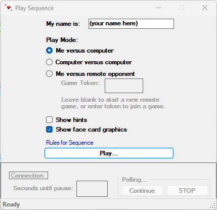
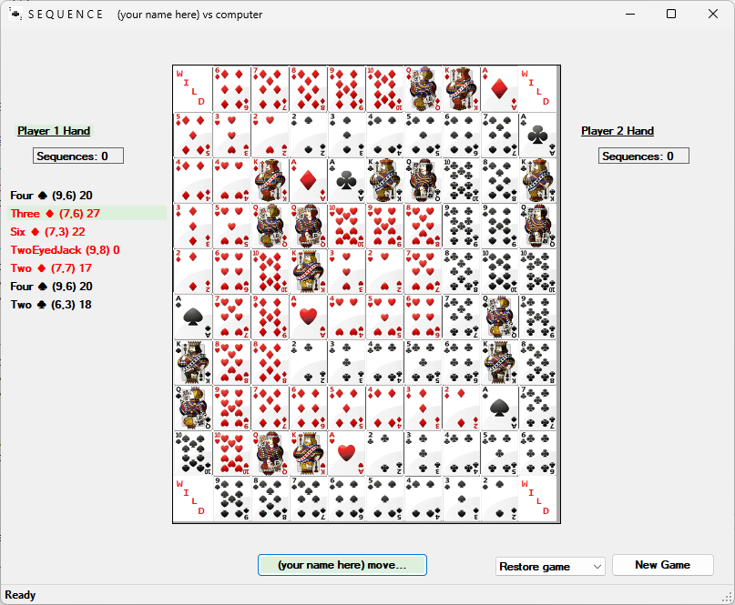
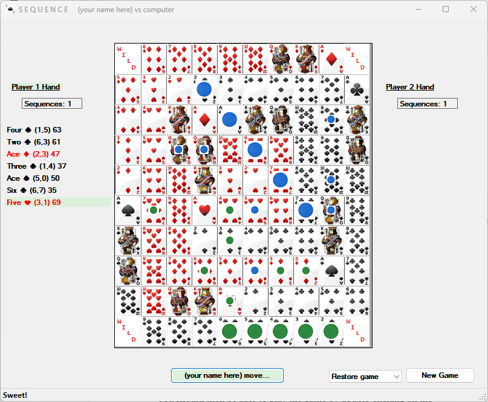

# Introduction

There are several ways to play the Sequence boardgame, including two or three player games, and playing with six or seven cards in each hand. The game implemented here is between two players, each holding seven cards in their hands. If you are unsure about the rules of Sequence, they can be reviewed at [**https://www.officialgamerules.org/sequence**](https://www.officialgamerules.org/sequence). This game has no ads and is completely free.

# Getting Started

Sequence is implemented as a Windows app that can be installed from [**https://github.com/SeqGamer/SequenceGameStates**](https://github.com/SeqGamer/SequenceGameStates).

From this page click on ‘Code’ and then ‘Download ZIP’. When the Zip file is downloaded, double click on it to unzip it, copy and save the **SequenceGameStates-main** folder to a convenient location on your computer. You should then be able to play the game by double-clicking on the SequencePlay.exe file in that folder.

# Play Modes

When the app opens, there are three play modes available, me versus the computer, computer versus the computer, and me versus remote opponent.

If you are having trouble finding a partner with whom to play, or are an introvert, the first two modes are for you. ‘Me versus the computer’ gives you a chance to improve your skills against a Sequence expert bot. The second mode, ‘Computer versus the computer’, is similar but it gives you the ability to play both sides of the game.

The third mode, ‘Me versus remote opponent’, lets you play against a friend who is also running the Sequence app on another computer. This friend could be in the same room as you, or in another country (not sure if WIFI is available on the moon yet). In this mode, when you click on ‘Play’, the app generates a six-digit Game Token. Communicate this game token to your remote opponent (by phone, text or yelling very loudly if necessary). When your opponent enters this Game Token in their app and clicks on ‘Play’, the game will start.

In each mode, your token color is green, and the opponent’s token color is blue.

A couple of other checkboxes make the game more interesting. Make sure you check or uncheck them as desired prior to clicking on ‘Play’. ‘Show hints’, when checked, provides helpful information on the game board. The cards in your hand are scored to indicate which card the app recommends is the best one to play, and where to play it. When this option is selected while playing against a remote opponent, it applies equally to them (not right giving you an unfair advantage). Additionally, the game board highlights the eligible game board squares where the cards in your hand can be played (in light green or light blue color). In a Sequence game board, each face card in a card deck appears twice, so each location on the game board is highlighted for each card in your hand.

The ’Show face card graphics’ checkbox gives you the option of displaying actual face cards on the game board instead of a text and miniature representation of each card face and suit. When graphic face cards are shown, the game board does not highlight eligible board squares for cards in your hand (if ‘Show hints’ is checked).

The ’Connection’ section at the bottom of the screen indicates the connection status with the remote opponent when attempting to connect for the third play mode. In most cases you can ignore this section, unless the ‘Seconds until pause’ counts down to ‘0’. In that case, you have the option to either click on ‘Continue’ to resume the connection attempt (assuming your opponent has not fallen asleep) or click on ‘Stop’ to halt the connection attempt.

# Play Mechanics

After you click on ‘Play’, the game board window opens and appears as follows, depending on what options were selected for ‘Show hints’ and ‘Show face card graphics’:

Your hand always appears on the left. If you are the remote opponent, your hand appears on the right and the player hand on the left is not visible.

The current sequence count is displayed for each player. When the count reaches ‘2’, the game is over, and the winner is declared.

Since the player selected ‘Show hints’ for the display above, the highest scored (27) best card is highlighted in light green. The board square in which to play the card is row 7, column 6 (i.e., (7,6)). Click on the highlighted ‘move’ command button at the bottom automatically selects and plays the best card. Optionally you can override that play and drag and drop the card you wish to play onto the game board. Double-click on the card is not supported as it is ambiguous as to which board square on which to play the card.

The ’Restore game’ dropdown is available if you wish to revert to an earlier version of the game to revise your strategy.

The ‘New game’ command button can be clicked to start a new game.

When the game is over, you may close the game board to go back to the main ‘Play’ window.

When playing against the computer, the computer responds instantly in response to your play. If it feels intimidating at first, you will get used to it. When playing against a remote opponent, the ‘move’ command button is disabled after your move while the app waits for your worthy opponent to respond. When the response arrives, the ‘move’ command button will again be enabled, allowing you to make your best move.

As you play, small green and blue dots will begin to litter the game board, indicating where you have played (see board illustration below). When a sequence is scored, large green (or blue) dots indicating the sequence are displayed.

Please send any feedback to [agb465@mail.usask.ca](mailto:agb465@mail.usask.ca).
